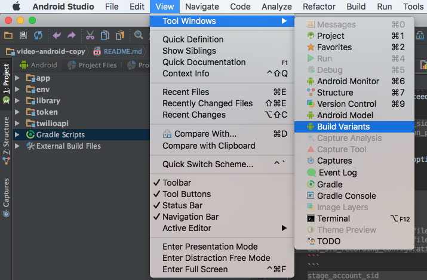
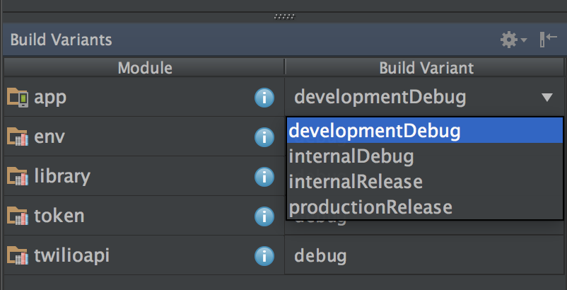

# Android Video SDK

- [Getting Started](#getting-started)
- [Project Modules](#project-modules)
- [Video App](#video-app)
- [Tests](#tests)
- [Native Debugging](#native-debugging)
- [Code of Conduct](#code-of-conduct)

The Android Video SDK provides multi-party voice and video calling on Android.

## Getting Started

To get started we recommend you use Android Studio for all your development.
In order to use our project please make sure you have the following installed:

1.  Install the Android SDK
    * Define `$ANROID_HOME`, `$ANDROID_SDK_HOME`, and `$ANDROID_SDK_ROOT`
1.  Install [Android NDK r12b](https://developer.android.com/ndk/downloads/older_releases.html)
    * Define `$NDK_ROOT`, `$ANDROID_NDK_HOME`, and `$ANDROID_NDK_ROOT`
    * Add line `ndk.dir=/path/to/ndk/r12b` to `local.properties`
1.  Add the following to your `$PATH`
    * `$ANDROID_HOME/tools`
    * `$ANDROID_HOME/platform-tools`
    * `$ANDROID_NDK_ROOT`
1.  **Twilio developers** download the internal google-services.json files here:
      * [Internal Debug (default)](https://console.firebase.google.com/project/video-app-79418/settings/general/android:com.twilio.video.app.internal.debug) - Download to `app/src/internal/debug`
      * [Internal Release](https://console.firebase.google.com/project/video-app-79418/settings/general/android:com.twilio.video.app.internal) - Download to `app/src/internal/release`
      * [Production Release](https://console.firebase.google.com/project/video-app-79418/settings/general/android:com.twilio.video.app) - Download to `app/src/production/release`
1.  Setup your Programmable Video credentials

    #### Video Android App
    These credentials are only required if you intend on using the development variant of the
    application. See [Building the Development Flavor](#building-the-development-flavor) for more
    details. Set your credentials in `twilio-video-app.json` located in the `app` directory.

    An example json file is provided under [app/twilio-video-app-example.json](app/twilio-video-app-example.json). 
    The following values MUST be set to build the development variant:

    ```
    account_sid
    api_key
    api_key_secret
    configuration_profile_sid
    ```

    The following values are allowed if you want to enable the development variant to switch 
    between topologies:

    ```
    sfu_configuration_profile_sid
    sfu_recording_configuration_profile_sid
    ```

    #### Video Android SDK
    Set your credentials in `twilio-video.json` located in the `library` directory.
    There are two sets of key/value pairs: mandatory and optional. Mandatory values are
    required to be set before building the project. Optional values are not required to be set,
    but as a Twilio developer they are required to run tests across different server
    environments and topologies.

    An example json file is provided under [library/twilio-video-example.json](library/twilio-video-example.json).
    For Twilio developers, these values represent prod credentials and a P2P configuration profile SID.

    ##### Mandatory Credentials

    The following values MUST be set to execute tests:

    ```
    account_sid
    api_key
    api_key_secret
    configuration_profile_sid
    ```

    ##### Optional Credentials

    The following values are for prod configuration profile SIDs that allow developers to
    test SFU and SFU Recording. Note these are optional values, but are required
    to ensure the entire test suite can be executed. The values are not mandatory because not
    every developer is guaranteed to have configuration profile SIDs for SFU or SFU Recording:

    ```
    sfu_configuration_profile_sid
    sfu_recording_configuration_profile_sid
    ```

    The following values are optional but are needed to run the test suite against dev
    or stage environments:

    ```
    dev_account_sid
    dev_api_key
    dev_api_key_secret
    dev_p2p_configuration_profile_sid
    dev_sfu_configuration_profile_sid
    dev_sfu_recording_configuration_profile_sid
    ```
    ```
    stage_account_sid
    stage_api_key
    stage_api_key_secret
    stage_p2p_configuration_profile_sid
    stage_sfu_configuration_profile_sid
    stage_sfu_recording_configuration_profile_sid
    ```

## Project Modules

* **app**: Provides a canonical multi-party voice and video calling application that uses the Android SDK
* **env**: Allows developers to set environment variables in native C/C++ using JNI.
This is only applicable for **Twilio developers**. Accessing dev or stage requires VPN.
* **library**: The Android SDK that provides the Java classes and interfaces used
by Android developers to perform multi-party voice and video calling
* **token**: A utility module for generating Video Access Tokens. **This module is intended to be 
used for testing and local development purposes only. Do not build an application that 
generates access tokens locally. Please follow the 
 [User Identity and Access Tokens guide](https://www.twilio.com/docs/api/video/identity) for proper
 instructions. Putting your Account SID, API Key, and API Key Secret inside 
 of an Android application will compromise your Twilio API credentials associated with your Twilio 
 account.**
* **twilioapi**: A utility module for using the Twilio REST API to get ice servers

## Video App

The Video App demonstrates a multi-party voice and video application built with the Android 
SDK. The application consists of the following [product flavors](http://tools.android.com/tech-docs/new-build-system/user-guide#TOC-Product-flavors):

1. Internal - Provides a set of features intended for internal testing. 
1. Production - The canonical application intended for every day use.
1. Development - Local development version intended for non Twilio developers.

### Building the Development Flavor
The development flavor of the application is meant for developers who would like to work with the 
Android SDK in the context of a full-fledged application without needing to bother with implementing 
authentication and managing a token server. **This variant generates access tokens locally within
the application. This practice is intended for local development and is not encouraged for your 
applications. Please follow the 
[User Identity and Access Tokens guide](https://www.twilio.com/docs/api/video/identity) for proper
token generation instructions in your application. Putting your Account SID, 
API Key, and API Key Secret inside of an Android application will compromise your Twilio API 
credentials associated with your Twilio account.**

To get started with the development flavor follow these steps:

1. Setup your `app/twilio-video-app.json` according to steps in [Getting Started](#getting-started).

2. In Android Studio navigate to View → Tool Windows → Build Variants.

    
  
3. Select the `developmentDebug` Build Variant under the app module.

    
  
4. Run the application.

## Tests

The tests are located in the library module and use the AndroidJUnitRunner.
The tests interact with the backend infrastructure and will result in billing activity on your account.

### Test Coverage
Enabling test coverage requires setting project property `testCoverageEnabled`. The snippet below
demonstrates executing unit and instrumentation tests with code coverage enabled.

`./gradlew -PtestCoverageEnabled=true library:clean library:jacocoTestReport`

## Native Debugging 

Enabling native debugging of the Android SDK requires changing the `defaultPublishConfig` of the
library module. By default, gradle publishes the release version of the Android SDK. To enable 
native debugging of the Android SDK in the app or library tests add 
`PUBLISH_CONFIG=debug` to your `local.properties`.

## Code of Conduct

This project adheres to the Contributor Covenant [Code of Conduct](CODE_OF_CONDUCT.md). By
participating, you are expected to uphold this code. Please report unacceptable behavior to
[video-conduct@twilio.com](mailto:video-conduct@twilio.com).
