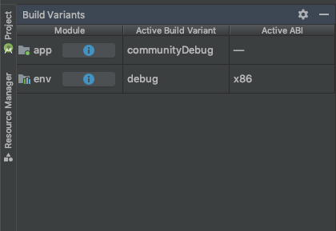
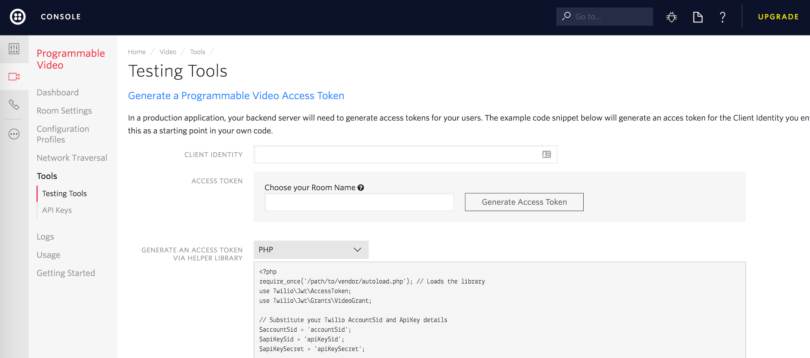

# Android Video Ahoy App

This application demonstrates multi-party voice and video built with [Twilio’s Programmable Video Android SDK](https://www.twilio.com/docs/video).

- [Getting Started](#getting-started)
    - [Authentication](#authentication)

# Getting Started

In order to run this application on an Android device or emulator, complete the following steps.

**NOTE:** A production version of this application will soon be available on the Google Play Store.
Thus, the below steps would not be required if you wanted to only view the application's behavior. 

## Authentication
Initiating live video and audio communication requires a proper access token from a valid Twilio account.
Perform the following to authenticate with Twilio successfully:

1. Ensure you are using the community build variant.


2. Login to the [Twilio Console](https://www.twilio.com/login), or create a free account [here](https://twilio.com/try-twilio).

3. Type in an identity and click on "Generate Access Token" from the [Testing Tools Page](https://www.twilio.com/console/video/runtime/testing-tools).


4. Add the access token string copied from the console to a variable named `TWILIO_ACCESS_TOKEN`
in your **local.properties** file.

```
TWILIO_ACCESS_TOKEN=abcdef0123456789
```

# Contributing

// TODO explain contributing best practices. Good example here.

## Code of Conduct

This project adheres to the [Contributor Covenant Code of Conduct](CODE_OF_CONDUCT.md). By participating, you are expected to uphold this code. Please report unacceptable behavior to video-conduct@twilio.com.